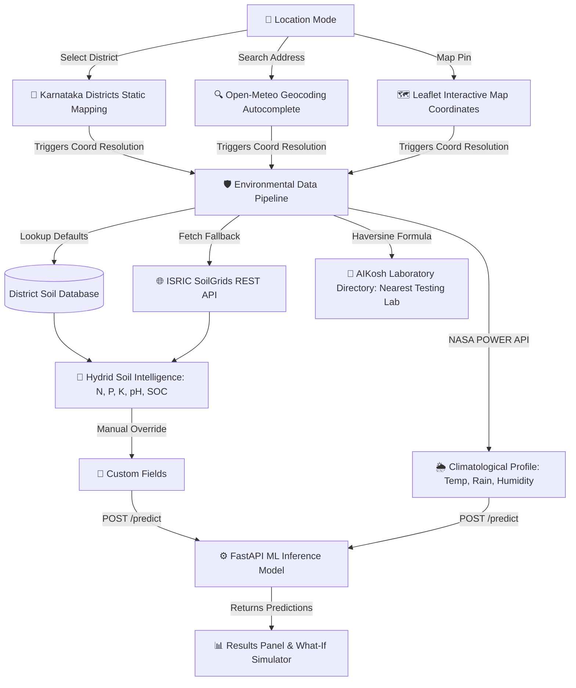

# 📍 CarbonIntel: Precision Agriculture Carbon Intelligence Platform

[](https://react.dev/)
[](https://fastapi.tiangolo.com/)
[](https://vite.dev/)
[](https://scikit-learn.org/)
[](https://xgboost.readthedocs.io/)
[](https://opensource.org/licenses/MIT)

CarbonIntel is a high-performance, single-page progressive workflow platform designed to evaluate and predict agricultural net carbon footprints (kg CO₂e/ha) and classify farm sustainability levels. Leveraging machine learning models (trained on real soil testing data), real-time climatology APIs, global soil databases, and physical laboratory directories, CarbonIntel provides growers, agronomists, and carbon credit researchers with actionable environmental insights.

---

## 🗺️ Architectural Workflow



---

## 🌟 Core Features

### 1. Progressive Single-Page Workflow
* **Section 1: Location & Data Source:** A single top-level card that dynamically swaps between **Karnataka District Selector**, **Search Address Autocomplete**, and **Interactive Leaflet Map Mode**. 
* **Section 2: Environmental Data:** Dynamic inputs for Soil Metrics and Climatological Profiles that auto-populate and display source validation badges.
* **Section 3: Farm Information:** Intuitive selections for crop categories (Rice, Corn, Wheat, Soybeans, Vegetables) and fertilizer applications.
* **Section 4: Results & Analytics:** Displays Carbon Footprint cards, Sustainability scores, Carbon Credits offsets, and comparative breakdown charts.

### 2. Hybrid Soil Intelligence System
Coordinates chosen via map pins or searches trigger a prioritized fetching system:
1. **District Defaults:** Pre-configured chemical soil distributions (mean/std dev) mapped across priority Karnataka regions.
2. **ISRIC SoilGrids API:** Queries global soil REST endpoints dynamically for Soil Organic Carbon (SOC) and pH based on latitude/longitude coordinates.
3. **Manual Entry Fallback:** Instant user override fields if physical soil health card reports are available.

### 3. NASA POWER Climatological Profiler
* Automatically queries NASA POWER APIs using coordinates to populate actual average Temperature (°C), Cumulative Rainfall (mm), and Relative Humidity (%) profiles, bypassing geocoding unreliability.

### 4. AIKosh Laboratory Proximity Engine
* Embeds a compiled directory of **467 physical Indian Soil Testing Labs** derived from raw AIKosh dataset downloads.
* Uses the **Haversine great-circle formula** to compute distances instantly, displaying the nearest official lab name, district/state, timings, and exact distance (in km) to help growers obtain verified physical testing.

### 5. Interactive Simulators
* **What-If Simulator:** Let users dynamically slide temperature, rainfall, crop selections, or fertilizer quantities to observe real-time simulated impacts on carbon emissions.
* **Optimization Engine:** Provides smart recommendations based on current inputs to suggest carbon-mitigating steps.

---

## 📊 Dataset & Model Details
* **Training Data:** Model targets are trained on combined regional distributions and **real soil testing data from Challakere Taluk** (Chitradurga District, Karnataka), comprising over 17,000 real physical samples from `research/soil/soil_sample.csv`.
* **Model Pipeline:** Built using `scikit-learn` Pipelines featuring robust Standard Scaling for numerical parameters, One-Hot Encoding for categorical features (`Crop_Type`, `Fertilizer_Type`), and tuned **XGBoost / Random Forest Regressors** serialized via `joblib`.

---

## 🛠️ Installation & Setup

### Prerequisites
* Python 3.8 or higher
* Node.js v18 or higher (with `npm`)

### 1. Clone the Project
```bash
git clone https://github.com/sidducs/CarbonIntel.git
cd CarbonIntel
```

### 2. Backend Setup
1. Navigate to the root directory and create a Python virtual environment:
   ```bash
   python -m venv venv
   ```
2. Activate the virtual environment:
   * **Windows (PowerShell):**
     ```powershell
     .\venv\Scripts\Activate.ps1
     ```
   * **macOS / Linux:**
     ```bash
     source venv/bin/activate
     ```
3. Install backend dependencies:
   ```bash
   pip install -r requirements.txt
   ```
4. Prepare the datasets & train the ML model:
   * Generate combined 11-district dataset (incorporating raw Challakere data):
     ```bash
     python src/generate_11_dist_data.py
     ```
   * Preprocess train-test splits:
     ```bash
     python src/preprocess.py
     ```
   * Train models and save model pipeline (`models/model.pkl`):
     ```bash
     python src/train.py
     ```
5. Start the FastAPI backend server:
   ```bash
   uvicorn app:app --reload --host 127.0.0.1 --port 8000
   ```
   * *The backend API documentation will be available locally at:* `http://127.0.0.1:8000/docs`

### 3. Frontend Setup
1. Open a new terminal window and navigate to the frontend directory:
   ```bash
   cd frontend
   ```
2. Install npm dependencies:
   ```bash
   npm install
   ```
3. Run the React-Vite client in development mode:
   ```bash
   npm run dev
   ```
   * *By default, the frontend runs on:* `http://localhost:5173`

---

## 📂 Repository Structure
```
CarbonIntel/
├── app.py                      # FastAPI endpoint definition & server entrypoint
├── requirements.txt            # Python dependencies
├── data/                       # Contains raw, train, and test dataset CSV files
├── models/                     # Serialized machine learning models (model.pkl)
├── research/                   # Jupyter Notebooks & original Challakere soil samples
├── src/                        # Data preprocessing, tuning, and training scripts
└── frontend/                   # React + Vite + Tailwind Client
    ├── src/
    │   ├── components/         # Page components (Maps, Charts, Sections)
    │   ├── hooks/              # Custom React Hooks (Autofill, Persistence)
    │   ├── services/           # API services (NASA POWER, SoilGrids, AIKosh Lab Lookup)
    │   └── utils/              # Hardened constants & validation helpers
    └── package.json            # npm dependencies and build scripts
```

---

## 📜 License
Distributed under the MIT License. See `LICENSE` for more information.
