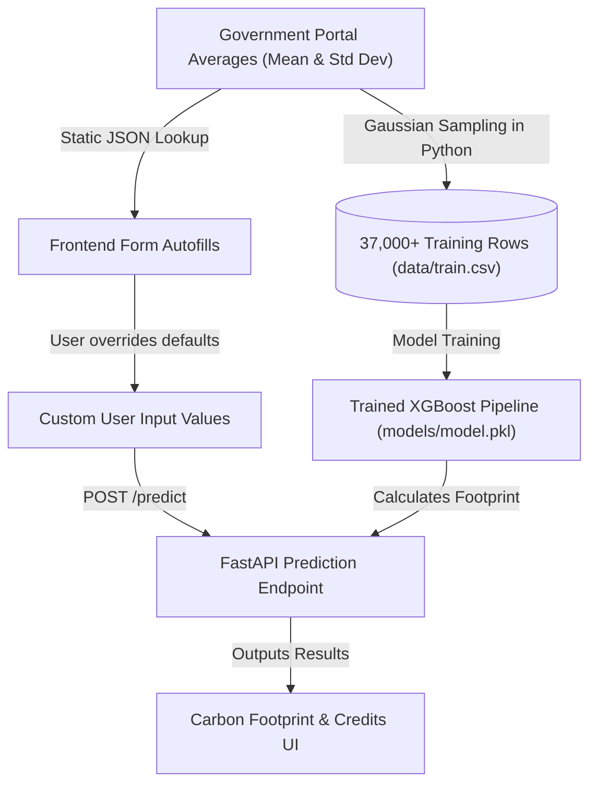

# 📊 Data Conversion & Mapping Methodology

This document explains how district-level average soil benchmarks from the Soil Health Card Portal are converted into individual data points for machine learning training and how they map to custom user inputs in the CarbonIntel dashboard.

---

## 🔄 Methodology Overview

---

## Phase 1: In the User Interface (Autofilling vs. Custom Inputs)

When a user interacts with the CarbonIntel dashboard, the district averages are only used as **default starting points** to simplify data entry:

1. **District Selector:** When a user selects a district (e.g., *Mysuru*), the frontend queries `districtSoilDefaults.js` to retrieve the baseline averages and immediately populates the input fields (SOC, N, P, K, pH).
2. **NASA Weather Profiler:** In parallel, the app uses the district coordinates to fetch actual historical climatology (temperature, rainfall, and humidity) from the NASA POWER API.
3. **Manual Overrides:** The farmer or researcher is free to overwrite any of the pre-populated default values with their own physical soil test card results (e.g., changing the default pH of $6.9$ to $7.2$).
4. **API Inference Payload:** When the user clicks **"Calculate Carbon Footprint"**, the frontend extracts the **exact values currently in the input boxes** (whether default or custom-modified) and sends them to the FastAPI `/predict` endpoint.

---

## Phase 2: In the Machine Learning Pipeline (Gaussian Distribution Sampling)

A machine learning algorithm cannot train on a few static average rows. To build a robust model capable of predicting variations, we converted district-level statistical aggregates into a dataset of **37,000+ individual sample points** using **Gaussian (Normal) Distribution Sampling**:

For each of the 10 priority districts (excluding Chitradurga, which uses 100% real physical sample rows from `soil_sample.csv`):
1. We retrieved the **Mean ($\mu$)** and **Standard Deviation ($\sigma$)** for each soil chemistry parameter from the Soil Health Card reports.
2. In the dataset compiler script (`src/generate_11_dist_data.py`), we ran a loop to generate **2,000 unique records per district**.
3. Each record's soil values were computed using a random standard normal variable $z \sim N(0,1)$:
   $$\text{Generated Parameter Value} = \mu + (z \cdot \sigma)$$

### Why this is mathematically sound:
* **Preserves Statistical Properties:** If you calculate the average of all 2,000 generated samples for a district, it equals the official government-reported average.
* **Simulates Field Heterogeneity:** It introduces natural variations (simulating different spots on different fields), teaching the machine learning model how changes in individual inputs correlate with changes in carbon emissions.
* **Prevents Regional Bias:** It balances the training set so the model doesn't overfit to a single geographical area.
