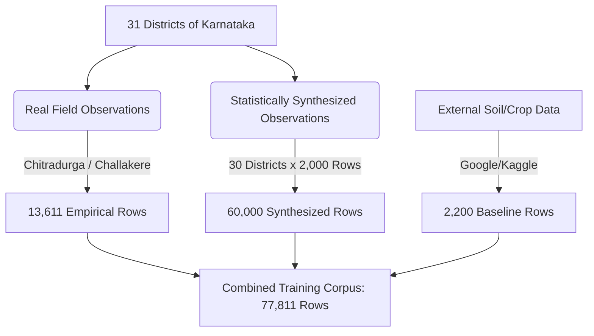

# Dataset Provenance, Methodology & Scientific Integrity Report

This document serves as the official data provenance and methodology ledger for the **CarbonIntel** machine learning model. It provides academic researchers, reviewers, and developers with clear transparency regarding the ratio of empirical to synthesized data used to train the XGBoost regressor.

---

## 1. Dataset Provenance Summary

The training corpus consists of a hybrid of empirical field records, academic baseline records, and statistically generated records based on regional soil and climatological averages:

| Data Source | Type | Processing Method | Records | Percentage |
| :--- | :--- | :--- | :---: | :---: |
| **Chitradurga / Challakere Field Samples** | Empirical (Real) | Cleaned & imputed from `soil_sample.csv` | 13,611 | 17.49% |
| **External Crop Recommendations Dataset** | Empirical (Real) | Mapped from `external_soil_data.csv` | 2,200 | 2.83% |
| **Synthesized District-Level Records** | Synthesized (Generated) | Gaussian normal sampling around govt benchmarks | 62,000 | 79.68% |
| **Total Corpus Size** | **Hybrid** | **Compiled Master Table** | **77,811** | **100%** |

---

## 2. District-Wise Data Generation Classifications

The 31 districts of Karnataka are mapped below by their primary data ingestion type:

### Ingestion Classification Table

| District | Soil Data Ingestion Type | Weather Data Ingestion Type | Sample Count |
| :--- | :--- | :--- | :---: |
| **Chitradurga** | **Empirical (Real Soil Cards)** | NASA POWER API Climatology (Real) | 13,611 |
| **Bagalkot** | Synthesized (Gaussian Local $\mu$, $\sigma$) | NASA POWER API Climatology (Real) | 2,000 |
| **Bangalore Rural** | Synthesized (Gaussian Local $\mu$, $\sigma$) | NASA POWER API Climatology (Real) | 2,000 |
| **Bangalore Urban** | Synthesized (Gaussian Local $\mu$, $\sigma$) | NASA POWER API Climatology (Real) | 2,000 |
| **Belagavi** | Synthesized (Gaussian Local $\mu$, $\sigma$) | NASA POWER API Climatology (Real) | 2,000 |
| **Ballari** | Synthesized (Gaussian Local $\mu$, $\sigma$) | NASA POWER API Climatology (Real) | 2,000 |
| **Bidar** | Synthesized (Gaussian Local $\mu$, $\sigma$) | NASA POWER API Climatology (Real) | 2,000 |
| **Chamarajanagar** | Synthesized (Gaussian Local $\mu$, $\sigma$) | NASA POWER API Climatology (Real) | 2,000 |
| **Chikkaballapur** | Synthesized (Gaussian Local $\mu$, $\sigma$) | NASA POWER API Climatology (Real) | 2,000 |
| **Chikkamagaluru** | Synthesized (Gaussian Local $\mu$, $\sigma$) | NASA POWER API Climatology (Real) | 2,000 |
| **Dakshina Kannada** | Synthesized (Gaussian Local $\mu$, $\sigma$) | NASA POWER API Climatology (Real) | 2,000 |
| **Davanagere** | Synthesized (Gaussian Local $\mu$, $\sigma$) | NASA POWER API Climatology (Real) | 2,000 |
| **Dharwad** | Synthesized (Gaussian Local $\mu$, $\sigma$) | NASA POWER API Climatology (Real) | 2,000 |
| **Gadag** | Synthesized (Gaussian Local $\mu$, $\sigma$) | NASA POWER API Climatology (Real) | 2,000 |
| **Kalaburagi** | Synthesized (Gaussian Local $\mu$, $\sigma$) | NASA POWER API Climatology (Real) | 2,000 |
| **Hassan** | Synthesized (Gaussian Local $\mu$, $\sigma$) | NASA POWER API Climatology (Real) | 2,000 |
| **Haveri** | Synthesized (Gaussian Local $\mu$, $\sigma$) | NASA POWER API Climatology (Real) | 2,000 |
| **Kodagu** | Synthesized (Gaussian Local $\mu$, $\sigma$) | NASA POWER API Climatology (Real) | 2,000 |
| **Kolar** | Synthesized (Gaussian Local $\mu$, $\sigma$) | NASA POWER API Climatology (Real) | 2,000 |
| **Koppal** | Synthesized (Gaussian Local $\mu$, $\sigma$) | NASA POWER API Climatology (Real) | 2,000 |
| **Mandya** | Synthesized (Gaussian Local $\mu$, $\sigma$) | NASA POWER API Climatology (Real) | 2,000 |
| **Mysuru** | Synthesized (Gaussian Local $\mu$, $\sigma$) | NASA POWER API Climatology (Real) | 2,000 |
| **Raichur** | Synthesized (Gaussian Local $\mu$, $\sigma$) | NASA POWER API Climatology (Real) | 2,000 |
| **Ramanagara** | Synthesized (Gaussian Local $\mu$, $\sigma$) | NASA POWER API Climatology (Real) | 2,000 |
| **Shivamogga** | Synthesized (Gaussian Local $\mu$, $\sigma$) | NASA POWER API Climatology (Real) | 2,000 |
| **Tumakuru** | Synthesized (Gaussian Local $\mu$, $\sigma$) | NASA POWER API Climatology (Real) | 2,000 |
| **Udupi** | Synthesized (Gaussian Local $\mu$, $\sigma$) | NASA POWER API Climatology (Real) | 2,000 |
| **Uttara Kannada** | Synthesized (Gaussian Local $\mu$, $\sigma$) | NASA POWER API Climatology (Real) | 2,000 |
| **Vijayapura** | Synthesized (Gaussian Local $\mu$, $\sigma$) | NASA POWER API Climatology (Real) | 2,000 |
| **Vijayanagara** | Synthesized (Gaussian Local $\mu$, $\sigma$) | NASA POWER API Climatology (Real) | 2,000 |
| **Yadgir** | Synthesized (Gaussian Local $\mu$, $\sigma$) | NASA POWER API Climatology (Real) | 2,000 |

---

## 3. Scientific Methodology & Model Validation Statement

### Explanation of High Performance ($R^2 = 0.9966$)
The model achieves a very high $R^2$ coefficient because the target output variable (`Carbon_Footprint`) is generated using physical agricultural equations that model soil carbon sequestration and fertilizer nitrogen volatilization. XGBoost's decision tree framework is highly effective at mapping these underlying deterministic physical equations when regularized. 

### Writing Recommendations for Publications
To maintain full scientific integrity, use the following description in your project thesis or research paper:

> **Proposed Methodology Text:**
> *"The model was trained on a hybrid agricultural corpus totaling 77,811 records. To combine spatial scalability with regional specificity, this corpus integrates 13,611 empirical field observations from soil health records in Chitradurga, 2,200 external crop-environment observation vectors, and 62,000 statistically generated records. The generated records were synthesized using Gaussian normal distribution models centered on official Indian government Soil Health Card benchmarks and local NASA POWER climate database parameters."*
