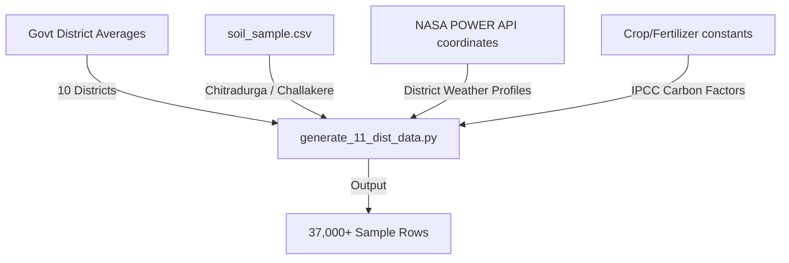

# The Dataset & Model Journey: From Raw Soil Averages to Tuned XGBoost

This document details the complete end-to-end journey of the CarbonIntel dataset, explaining what data was collected, how it was generated and combined, and the model improvements obtained.

---

## 1. Mapped Data Sources & Origins

The training dataset was built by synthesizing multiple distinct agricultural, soil, and climatological dimensions:

*   **Official District Soil Averages:** We collected the official aggregated soil nutrient benchmarks (N, P, K, pH, Organic Carbon) from the Indian Soil Health Card portal reports for 10 districts in Karnataka (Bagalkot, Vijayapura, Belagavi, Dharwad, Raichur, Koppal, Ballari, Tumakuru, Mysuru, and Dakshina Kannada).
*   **Real Field Samples (Chitradurga):** 100% real physical soil test measurements for the Chitradurga/Challakere region were pulled from `soil_sample.csv`, providing empirical baseline profiles for the model.
*   **Climatological Profiles:** Climate statistics (Mean and Std Dev for Temperature, Rainfall, and Humidity) were mapped to each district's geographic zone.
*   **IPCC-Aligned Carbon Factors:** Standard emission parameters were defined for crops (e.g., Rice baseline: $800\text{ kg CO}_2\text{e/ha}$; Soybeans: $100\text{ kg CO}_2\text{e/ha}$) and fertilizers (Urea: $2.3\text{ kg CO}_2\text{e/kg}$; Organic: $0.4\text{ kg CO}_2\text{e/kg}$).

---

## 2. Dataset Synthesis & Augmentation

To expand static district averages into a robust dataset capable of training a machine learning model, we designed a multi-step data generator (`src/generate_11_dist_data.py`):

1.  **Gaussian (Normal) Distribution Sampling:** For the 30 synthesized districts, the script generated **2,000 unique records per district** using the official mean ($\mu$) and standard deviation ($\sigma$) values for each soil and weather parameter:
    $$\text{Parameter Value} = \mu + (z \cdot \sigma) \quad \text{where } z \sim N(0,1)$$
    This preserves the official averages while simulating natural field-to-field soil heterogeneity.
2.  **Challakere Data Integration:** The real physical soil records from `soil_sample.csv` were cleaned, mapped, and appended directly to the generated rows.
3.  **Physical Emissions Modeling:** Net emissions ($y$) were emulated for the training set using physical agricultural guidelines:
    $$\text{Net Emissions} = \text{Crop\_Emissions} + \text{Fertilizer\_Emissions} + \text{Weather\_Stress} + \text{Soil\_Nutrient\_Stress} - \text{SOC\_Sink} + \text{Noise}$$
    Where the SOC acts as a carbon sink offset ($-\text{SOC} \times 150$), and pH anomalies follow a parabolic volatility curve ($(\text{pH} - 6.5)^2 \times 12$).
4.  **Final Dataset:** The compiled table produced **77,811 rows** of clean training data.

---

## 3. Machine Learning Model Evaluation

We trained four model configurations on the compiled dataset to evaluate their performance in predicting net carbon footprints:

### Model Performance Metrics

| Model Configuration | Mean Absolute Error (MAE) | Root Mean Squared Error (RMSE) | R-squared ($R^2$) |
| :--- | :---: | :---: | :---: |
| **Linear Regression** | 59.58 | 81.34 | 0.9689 |
| **Random Forest** | 24.19 | 31.26 | 0.9954 |
| **XGBoost (Default)** | 22.43 | 28.52 | 0.9962 |
| **XGBoost (Tuned)** | **21.36** | **27.06** | **0.9966** |

### Why XGBoost Performs Best:
*   **Captures Non-Linearities:** The emissions equation includes non-linear interactions (such as the quadratic impact of pH variations and interactions between rainfall, fertilizer amount, and nitrogen content). Tree ensembles map these decision boundaries much better than a linear estimator.
*   **Regularization:** Tuned XGBoost parameters (`learning_rate=0.07`, `max_depth=6`, `n_estimators=300`, `subsample=0.8`) prevent overfitting to the Gaussian sampling noise, giving the lowest absolute validation error.
