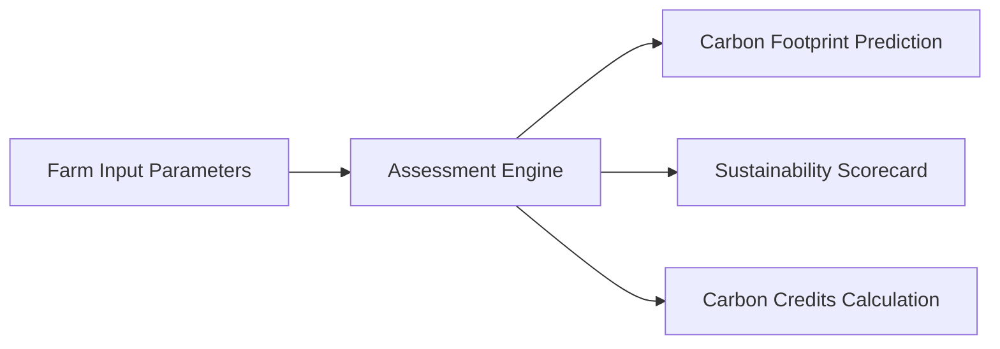

# Core Platform Features

This document provides a detailed description of the operational modules and functional capabilities built into the CarbonIntel platform.

---

## 1. Soil & Farm Assessment Engine

The primary feature of CarbonIntel is its Soil & Farm Assessment Engine, which provides calculations across three core metrics:

### Carbon Footprint Prediction
* **Method**: Submits inputs (Crop, Soil nutrients, fertilizer, weather) to the FastAPI machine learning model.
* **Output**: Net emissions calculated in kilograms of carbon dioxide equivalent per hectare ($\text{kg CO}_2\text{e/ha}$).

### Sustainability Classification
* **Green / High Sustainability** ($< 400\text{ kg CO}_2\text{e/ha}$): Highly optimized, high carbon sink potential.
* **Yellow / Medium Sustainability** ($400 - 1200\text{ kg CO}_2\text{e/ha}$): Moderate fertilizer usage with moderate emissions.
* **Red / Low Sustainability** ($> 1200\text{ kg CO}_2\text{e/ha}$): Heavy nitrogen fertilization or waterlogged anaerobic cultivation (e.g. wet Rice fields).

### Carbon Credits Yield Calculation
* Calculates carbon offsets generated relative to a regional baseline ($1200\text{ kg CO}_2\text{e/ha}$).
* **Formula**:
  $$\text{Credits (tonnes)} = \max\left(0, \frac{1200 - \text{Predicted Footprint}}{1000}\right)$$
* Visualizes credits as tradeable offsets ($\text{t CO}_2\text{e/ha}$) to incentivize regenerative farming.

### Smart Recommendations & Risk Assessment
* **Nitrogen Warning**: Flags if Nitrogen level ($N\_Content$) combined with fertilizer application ($Fertilizer\_Amount$) presents a high $N_2O$ volatilization risk.
* **Acidification Danger**: Warns if pH drops below $5.5$, which affects nutrient uptake.
* **Soil Organic Carbon (SOC) Improvement**: If SOC $< 1.5\%$, recommends cover crops, biochar, or reduced tillage to increase soil organic carbon and build carbon sinks.

---

## 2. Interactive Analysis & Benchmarking

* **Regional Insights**: Compares soil features with optimal values, identifying nutrient imbalances.
* **Benchmark Comparison**: Compares the current farm's footprint against:
  * Global Target Baseline ($600\text{ kg/ha}$)
  * National Average ($900\text{ kg/ha}$)
* **Sustainability Roadmap**: Outlines a 4-step progressive plan to optimize cultivation and maximize soil carbon retention.

---

## 3. What-If Simulator & Optimization Engine

* **Real-time Adjustments**: Features interactive sliders for:
  * Fertilizer Amount (kg/ha)
  * Soil Organic Carbon (SOC %)
* **Instant Recalculation**: Renders carbon footprint changes immediately using a client-side linear modeling approximation ($y = \mathbf{w}^T\mathbf{x} + b$). This lets farmers run quick scenarios without making backend API requests.
* **Optimal Nutrient Target Generator**: Computes the exact fertilizer dosage reduction required to reach a specific target sustainability tier.

---

## 4. Historical Records & Comparisons

* **Assessment History (`localStorage`)**: Persists previous run configurations, timestamped predictions, and regional coordinates.
* **Comparison Matrix**: Displays side-by-side tables comparing multiple historic assessments, tracking changes in carbon footprints.

---

## 5. Historical Weather Retrieval & Export

* **NASA POWER API integration**: Queries daily weather telemetry for any selected farm location over custom date ranges.
* **Summary Metrics Card**: Computes average temperature, humidity, rainfall, and total retrieved days.
* **CSV Export**: Downloads a detailed daily CSV report of historical weather data.

---

## 6. AI Copilot Integration

* **LLM Engine**: Features a rule-based AI Copilot in `src/services/copilotEngine.js`.
* **Prompt Processing**: Evaluates natural language queries (e.g., *"How can I lower my cotton carbon footprint?"*, *"Explain soil carbon sinks"*) and generates context-aware, agriculture-focused answers.

---

## 7. PDF Executive Summary Reports

* Incorporates a PDF generator using `html2canvas` and `jsPDF`.
* Generates styled multi-page PDF reports containing farm inputs, prediction scores, recommendations, and benchmark charts.
