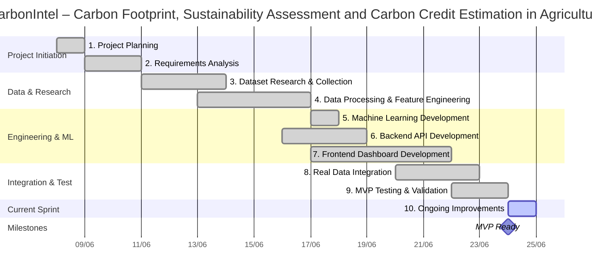

# Project Gantt Chart: CarbonIntel

Below is the Gantt chart and project breakdown illustrating the timeline, tasks, status, and dependencies for the **CarbonIntel** project from **08/06/2026 to 24/06/2026**.

---

## Gantt Chart Visualization

---

## Detailed Task Breakdown

### 1. Project Planning (08/06/2026 - 09/06/2026)
*   **Status:** `Completed` (Green)
*   **Details:**
    *   Defined project objectives.
    *   Identified sustainability assessment workflow.
    *   Selected technology stack (React, FastAPI, XGBoost).

### 2. Requirements Analysis (10/06/2026 - 11/06/2026)
*   **Status:** `Completed` (Green)
*   **Dependencies:** After *Project Planning*
*   **Details:**
    *   Identified input parameters (SOC, N, P, K, pH).
    *   Defined fertilizer and weather requirements.
    *   Defined output metrics (Carbon Footprint, Sustainability, Carbon Credits).

### 3. Dataset Research & Collection (11/06/2026 - 14/06/2026)
*   **Status:** `Completed` (Green)
*   **Dependencies:** After *Requirements Analysis*
*   **Details:**
    *   Soil Health Card dataset research.
    *   Karnataka soil data collection.
    *   Crop Recommendation dataset collection.
    *   Weather API evaluation.

### 4. Data Processing & Feature Engineering (13/06/2026 - 17/06/2026)
*   **Status:** `Completed` (Green)
*   **Details:**
    *   Dataset cleaning.
    *   Feature mapping.
    *   SOC enrichment.
    *   Fertilizer parameter generation.
    *   Dataset merging.

### 5. Machine Learning Development (15/06/2026 - 18/06/2026)
*   **Status:** `Completed` (Green)
*   **Dependencies:** After *Data Processing*
*   **Details:**
    *   Linear Regression training.
    *   Random Forest training.
    *   XGBoost training.
    *   Model comparison and selection.

### 6. Backend API Development (16/06/2026 - 19/06/2026)
*   **Status:** `Completed` (Green)
*   **Details:**
    *   FastAPI setup.
    *   Prediction endpoint development.
    *   Model integration.
    *   API testing.

### 7. Frontend Dashboard Development (17/06/2026 - 22/06/2026)
*   **Status:** `Completed` (Green)
*   **Details:**
    *   React dashboard implementation.
    *   Prediction form creation.
    *   Results visualization.
    *   Responsive UI development.

### 8. Real Data Integration (20/06/2026 - 23/06/2026)
*   **Status:** `Completed` (Green)
*   **Details:**
    *   NASA POWER climatology integration.
    *   Soil dataset integration.
    *   District autofill workflow.
    *   AIKosh dataset exploration.

### 9. MVP Testing & Validation (22/06/2026 - 24/06/2026)
*   **Status:** `Completed` (Green)
*   **Details:**
    *   End-to-end testing.
    *   Model validation.
    *   Workflow verification.
    *   Performance review.

### 10. Ongoing Improvements (24/06/2026)
*   **Status:** `In Progress` (Orange/Blue Active)
*   **Details:**
    *   UX workflow simplification.
    *   Map workflow debugging.
    *   SoilGrids validation.
    *   Research paper preparation.
