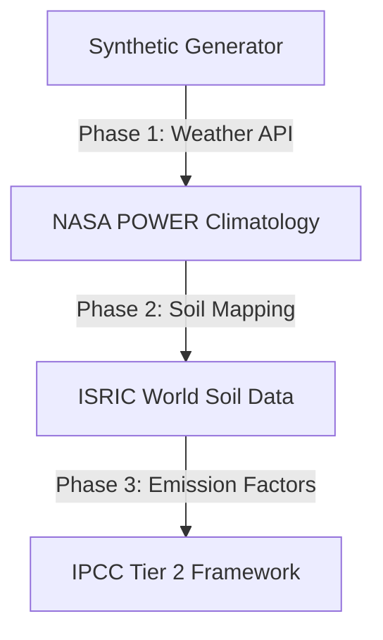

# Real-World Data Integration Roadmap

This document outlines the transition plan to replace CarbonIntel's synthetic simulation values with empirical, research-grade field data.

---

## 1. Data Sources Transition Plan

To improve prediction accuracy, synthetic values will be systematically replaced with verified environmental telemetry:



### Weather Telemetry Integration
* **Current State**: Manual entry with Open-Meteo current forecasts.
* **Target Integration**: Pull historical solar radiation, daily temperature ranges, and cumulative rainfall records directly from the **NASA POWER API** (using grid averages of $0.5^\circ \times 0.5^\circ$ resolution).

### Soil Telemetry Integration
* **Current State**: Manual entry of soil parameters.
* **Target Integration**: Connect coordinates to the **ISRIC SoilGrids API** to automatically retrieve baseline estimations for Soil Organic Carbon (SOC), pH, and bulk density.

### Emission Factors Integration
* **Current State**: Handcrafted baseline values.
* **Target Integration**: Map regional fertilizer emissions using local greenhouse gas parameters (e.g., matching IPCC Tier 2 guidelines for local nitrous oxide conversion rates, rather than general Tier 1 global constants).

---

## 2. Data Collection Architecture

```text
  [Geocoded Coordinates]
           |
           v
  [External Services Orchestrator]
    ├── SoilGrids API (Soil attributes: SOC, pH, K, N, P)
    ├── NASA POWER API (Weather attributes: Climatology Temp, Rainfall)
    └── IPCC Registry (Local Emission Constants)
           |
           v
  [Validated Empirical Row] ---> [Database Repository]
```

---

## 3. Retraining Strategy

As real-world farm data is collected, the training pipeline will transition to a semi-automated schedule:

1. **Data Ingestion**: Mapped farm outputs and soil logs are saved to a central database.
2. **Data Labeling**: Ground-truth emissions are calculated using verified soil respiration chambers and regional agricultural surveys.
3. **Pipeline Retraining**: The training pipeline (`src/train.py`) will automatically trigger when new empirical rows are added, evaluating Linear Regression, Random Forest, and XGBoost models.
4. **Weights Evaluation**: If a retrained model beats the active production model's $R^2$ score and lowers its Root Mean Squared Error (RMSE) on validation sets, the new model file is deployed.

---

## 4. Validation Strategy

* **K-Fold Cross-Validation**: Use 5-fold stratified cross-validation to verify model stability and reduce overfitting risks.
* **Shadow Deployment**: Deploy new models to a "shadow" endpoint first. This runs predictions alongside the active production model to compare outputs on real user inputs before full promotion.
* **Residual Analysis**: Monitor model residuals ($y_{\text{true}} - y_{\text{pred}}$) to identify performance bottlenecks on specific crop classes or soil types.
