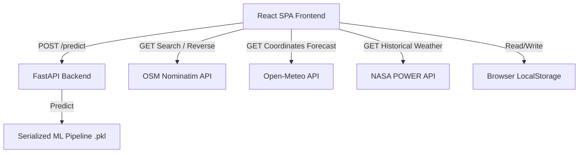
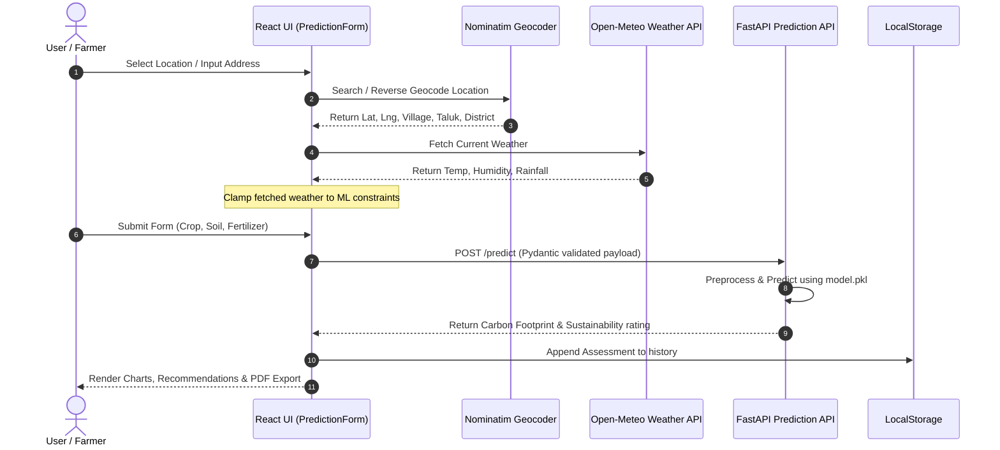

# System Architecture Documentation

This document describes the high-level system architecture of the CarbonIntel platform.

---

## Technology Stack

The platform is designed as a decoupled, multi-tier system:

| Layer | Technology | Role |
| :--- | :--- | :--- |
| **Frontend UI** | React (SPA), Vite, Tailwind CSS, Leaflet | Presentation, client-side simulations, and UI interaction |
| **Prediction API** | FastAPI, Uvicorn | High-performance machine learning inference service |
| **Data Fetchers** | Open-Meteo API, NASA POWER API, Nominatim | External weather parameters and reverse geocoding |
| **Client Storage** | LocalStorage | Browser-based assessment history and theme preferences |

---

## Architectural Layout

The system follows a modern decoupled architecture where the Frontend acts as a client-side orchestrator, directly querying external geocoding and weather APIs, and routing structured farm features to the ML inference backend:



### Component Relationships

1. **Frontend (Vite + React)**:
   * **`AppRoutes.jsx`**: Handles routing across pages (Dashboard, Analysis, Optimization, Reports, Copilot, About).
   * **`Navbar.jsx`**: Core layout menu and dark mode theme toggle.
   * **`PredictionForm.jsx`**: Gathers farm parameters, fetches weather, executes predictions, and passes outputs to results cards.
   * **`weatherService.js` / `geocodingService.js`**: Integrates coordinates search and Open-Meteo forecasts.
   * **`weatherHistoryService.js`**: Fetches NASA POWER daily grids and outputs CSV reports.

2. **Inference Backend (FastAPI)**:
   * **`app.py`**: The API runner containing input validation (via Pydantic), model deserialization (via joblib), and inference routing.
   * **`models/model.pkl`**: Serialized scikit-learn pipeline (preprocessing StandardScaler + Encoder combined with the trained Regressor).

---

## Folder Structure

Below is the verified layout of the CarbonIntel platform workspace:

```text
CarbonFootprintML/
├── app.py                     # FastAPI API entrypoint
├── main.py                    # Server run script
├── test_api.py                # Backend endpoint test suite
├── requirements.txt           # Python backend dependencies
├── models/
│   ├── model.pkl              # Serialized training pipeline
│   └── model_metadata.pkl     # Categorical allowed crop/fertilizer lists
├── data/
│   ├── train.csv              # 80% Preprocessed Training Dataset
│   └── test.csv               # 20% Preprocessed Validation Dataset
├── src/
│   ├── preprocess.py          # Data cleaner & encoder
│   ├── train.py               # Model compiler, evaluator, tuner
│   └── validation.py          # Validation routines and VIF metrics
├── docs/                      # Technical system documentation
└── frontend/
    ├── package.json           # Node project manifest
    ├── vite.config.js         # Bundler configurations
    ├── reports/
    │   └── production_audit.md # Hardening audit findings
    └── src/
        ├── App.jsx            # Main app shell & global error boundary
        ├── main.jsx           # App mounting point
        ├── components/        # Reusable dashboard widgets & charts
        ├── pages/             # Route page containers
        ├── routes/            # React-router configurations
        └── services/          # API, Weather, Geocoding, Copilot connectors
```

---

## Data Flow Diagrams

The detailed flow of an assessment prediction sequence follows these steps:


