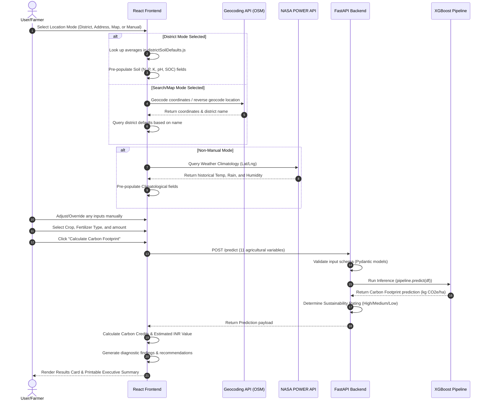

# CarbonIntel Complete Application Workflow

This document explains the runtime operational flow and data pipeline of the **CarbonIntel** sustainability dashboard, tracing how actions in the user interface trigger backend ML inference.

---

## 🗺️ System Data Flow Diagram

---

## ⚙️ Step-by-Step Runtime Breakdown

### Phase 1: Location & Input Initialization
The workflow begins when the user selects a location selection mode:
1.  **Karnataka District:** Selecting a district looks up soil statistics from `districtSoilDefaults.js` and immediately pre-fills N, P, K, pH, and SOC.
2.  **Search Address:** Typing a location calls the geocoding service to retrieve coordinates, which then trigger reverse geocoding to resolve the district name and populate defaults.
3.  **Select on Map:** Placing a pin updates latitude/longitude coordinates and looks up regional soil defaults.
4.  **Manual Input:** Bypasses location selection completely, immediately rendering blank inputs for custom entry.

### Phase 2: Weather API Integration (NASA POWER)
For non-manual modes, the frontend fetches telemetry based on coordinates:
*   Queries NASA's climatological registry for historical temperature range, annual cumulative rainfall, and relative humidity.
*   Autofills the climatology cards in the form interface.

### Phase 3: Input Adjustments (Manual Overrides)
*   The form unlocks all input fields. The user can manually adjust any soil or weather parameters (e.g. updating pH based on a fresh soil card report).
*   The user selects the crop type, fertilizer type, and amount.

### Phase 4: Backend API Prediction
When "Calculate Carbon Footprint" is clicked:
1.  **API Call:** The React frontend fires a POST request to `/predict` containing:
    `{ Crop_Type, SOC, N_Content, P_Content, K_Content, pH, Fertilizer_Type, Fertilizer_Amount, Temperature, Rainfall, Humidity }`.
2.  **Inference Execution:** The FastAPI server cleans the inputs, loads the serialized pipeline `models/model.pkl`, executes inference via the tuned XGBoost regressor, and computes the sustainability rating based on threshold boundaries:
    *   `< 400 kg CO2e/ha` $\rightarrow$ **High**
    *   `400 - 1200 kg CO2e/ha` $\rightarrow$ **Medium**
    *   `> 1200 kg CO2e/ha` $\rightarrow$ **Low**
3.  **Response Payload:** The backend returns the predicted footprint value and rating.

### Phase 5: Local Credit Evaluation & Rendering
Once the frontend receives the prediction:
1.  **Carbon Credits:** Calculated locally in the UI:
    $$\text{Credits} = \max\left(0, \frac{800 - \text{Footprint}}{1000}\right) \text{ tCO}_2\text{e/ha}$$
2.  **Estimated Financial Value:** Multiplies credits by ₹1,500 INR/tonne offset value.
3.  **Recommendations Engine:** Compares farm properties (such as low SOC or high nitrogen) to generate customized diagnostic actions.
4.  **Executive Summary:** Renders a clean management report with a print button to export as a PDF.
