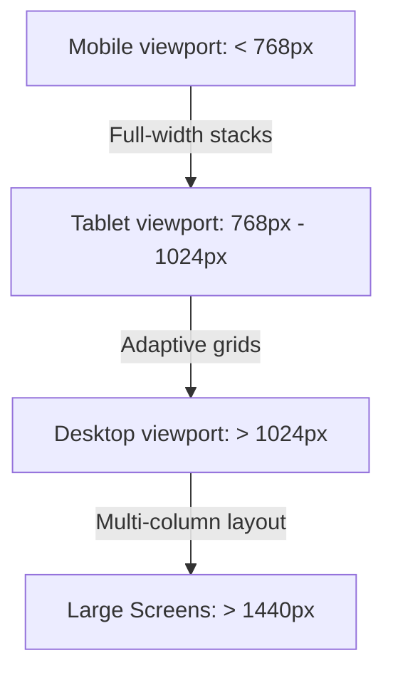

# UI/UX Documentation

This document describes the design system, color hierarchy, interactive feedback patterns, accessibility implementations, and layout structures of the CarbonIntel web interface.

---

## 1. Design System & Theme Modes

CarbonIntel uses a modern dark-mode-first user interface with light mode compatibility. Theme context coordinates transitions across elements using Tailwind CSS CSS selectors:

* **Transitions**: Smooth theme shifting is achieved with class-toggled animations:
  ```css
  transition-colors duration-300
  ```

---

## 2. Color System & Palettes

The UI uses semantic colors to represent sustainability ratings and layout hierarchy:

### Core Palette
* **Emerald (Brand Base)**: `emerald-600` (`#059669`) in light, `emerald-500` (`#10b981`) in dark. Represents eco-efficiency and agricultural optimization.
* **Slate (Neutral Base)**: `slate-50` to `slate-950`. Provides subtle neutral contrast without harsh pure black or white.

### Status Indicators
| Status / Level | Tailwind Class | HSL / Hex Code | Usage |
| :--- | :--- | :--- | :--- |
| **High Sustainability** | `text-emerald-600` | `#059669` | Carbon credits, high eco ratings |
| **Medium Sustainability**| `text-amber-500` | `#f59e0b` | Moderate warning, average footprints |
| **Low Sustainability** | `text-rose-500` | `#ef4444` | High carbon warnings, critical values |

---

## 3. Typography

The platform utilizes clean, modern sans-serif typography:
* **Font Family**: Primary stack relies on the system default sans-serif (such as Inter, Roboto, or UI-sans-serif) for quick loading and maximum readability:
  ```css
  font-family: ui-sans-serif, system-ui, -apple-system, sans-serif;
  ```
* **Weights**:
  * `font-normal` (400) for body copy.
  * `font-semibold` (600) for sub-headers and table values.
  * `font-black` (900) for primary module headers.

---

## 4. Card Components

Dashboard layout blocks are structured using standard card containers:
* **Light Mode**: White backgrounds with subtle borders and shadows:
  ```css
  bg-white border-slate-100 shadow-xs rounded-2xl
  ```
* **Dark Mode**: High contrast deep grey backgrounds:
  ```css
  dark:bg-slate-800 dark:border-slate-800/80
  ```

---

## 5. Responsive Design Strategy

The app utilizes Tailwind's mobile-first responsive breakpoints:



* **Mobile (Stacked Panels)**:
  * Input forms, maps, and simulation cards stack vertically.
  * Nav link lists transform into a sliding menu drawer.
* **Desktop (Grid System)**:
  * Prediction Form and map selection coordinates display side-by-side.
  * Analysis charts grid splits into double columns.

---

## 6. Accessibility & Keyboard Navigation

The platform implements accessibility practices (WCAG compliant):
* **Semantic HTML**: Standard layouts (`<main>`, `<nav>`, `<section>`) are used to support screen readers.
* **Keyboard Focus**: Interactive elements include visible focus states for keyboard-only navigation:
  ```css
  focus:outline-none focus:ring-2 focus:ring-emerald-500/50
  ```
* **Aria Labels**: Non-text controls (such as the hamburger trigger or dark mode toggle) include clear `aria-label` descriptions.
* **Keyboard Autocomplete**: Autocomplete dropdown lists support keyboard arrow navigation (`ArrowDown`/`ArrowUp`) and selection triggers (`Enter`).
* **Contrast Ratios**: Font weights and color combinations are selected to maintain clear contrast and readability across all screen sizes.
